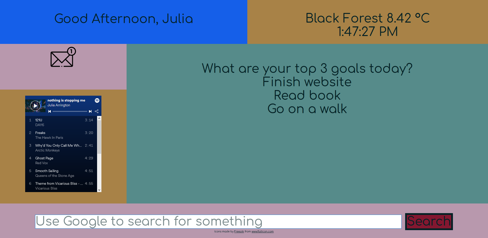

This project is an example of a dashboard that could be used as a home screen for a web browser.
Features:

- A personalized and time sensitive greeting. The user can enter their name, which will be saved when they come back and the greeting (Good Morning/Afternoon/Evening) will display depending on the time of day.
  -- Inspired by Traversy Media's tutorial: https://www.youtube.com/watch?v=fSTQzlprGLI
- Email notification. The email icon displays the number of unread emails. When the user clicks on the icon the connected emails are listed as well as an indication of how many emails are unread in each account. This is simulated because connecting email providers is way to complicated for this example program.
- Music player. This is just pasted from Spotify's API.
- To-Do List. This list asks the user to enter their top three goals. This is also modified from Traversy Media's tutorial.
- Google search bar. Type in your querey and a google page with that search will be opened.
- Weather and time. The time is from Traversy Media. The weather is from a Dev Ed tutorial: https://www.youtube.com/watch?v=wPElVpR1rwA I used Open Weather as my weather API.

What I learned:
I learned a lot about Local Storage. This is my second time using this JS feature. I think the first time I tried to use it I over complicated things.
I also learned how to connect and use APIs. I always thought it would be super complicated and something left to senior devs. I realized that it was actually pretty simple and that API developers write good documentation because they _want_ you to use their API. I think my next project will use the Spotify API.
